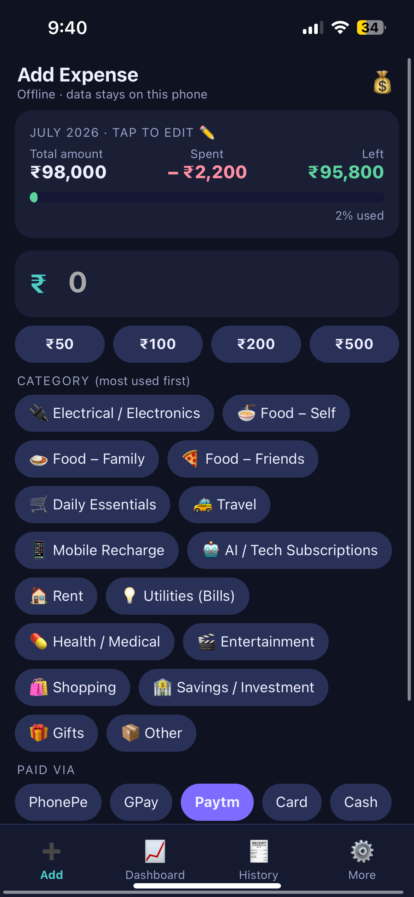
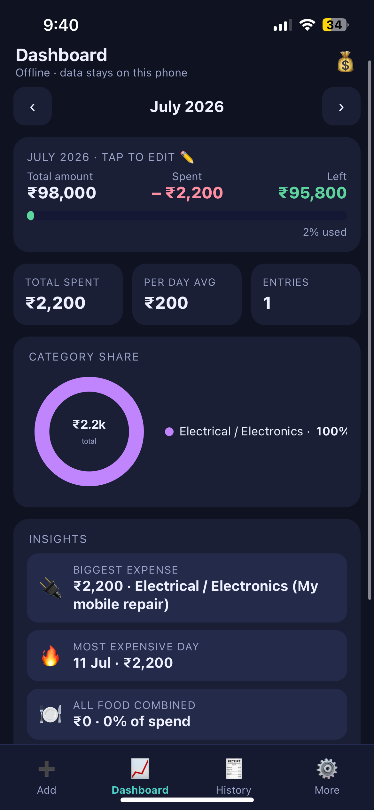
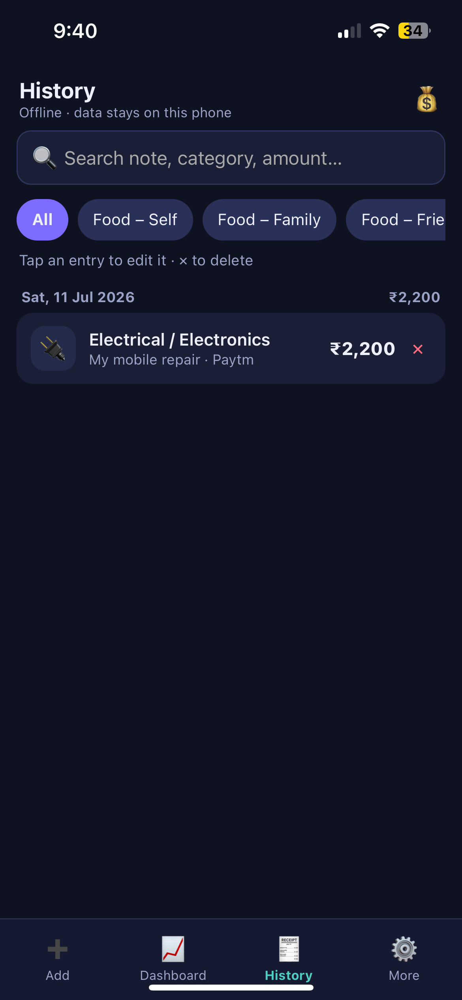
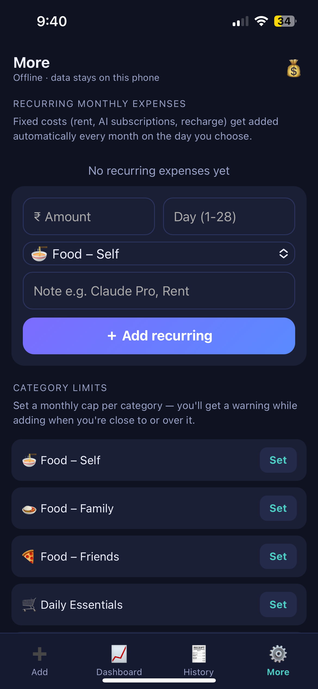

# 💰 My Expense Tracker

A personal, offline-first expense tracker built as a lightweight PWA (Progressive Web App). Made for tracking every rupee of daily spending — food, travel, recharges, AI subscriptions and more — right from your phone.

**Works on both iOS and Android** from the same link: **[chandan12ar.github.io/expense-tracker](https://chandan12ar.github.io/expense-tracker/)** 📱

> 🤖 Want a native Android APK instead? See [expense-tracker-android](https://github.com/chandan12ar/expense-tracker-android).

## 📸 Screenshots

| Add Expense | Dashboard | History | Recurring & Limits |
|:---:|:---:|:---:|:---:|
|  |  |  |  |

## ✨ Features

- **Monthly budget wallet** — set your total amount once; every expense auto-deducts and shows Total / Spent / Left
- **16 built-in categories + create your own** 🆕 — tap **＋ New**, type a name (start with an emoji like 🐶 Pet Care), and it works everywhere: filters, limits, recurring, backups
- **Recurring expenses** — rent, subscriptions and recharges added automatically each month
- **Per-category limits** with warnings when you're close to or over the cap
- **Dashboard** — donut chart, category breakdown, insights (biggest expense, most expensive day, all-food total), 6-month trend
- **History** with search, filters, tap-to-edit and undo delete
- **Quick entry** — ₹50/₹100/₹200/₹500 buttons, most-used categories shown first, PhonePe pre-selected
- **Backup & restore** — JSON backup (includes custom categories) and CSV export for Excel
- **100% offline & private** — no server, no account; all data stays in your phone's local storage

## 📱 Install

**iPhone:** open [the app](https://chandan12ar.github.io/expense-tracker/) in **Safari** → Share → **Add to Home Screen**

**Android:** open [the app](https://chandan12ar.github.io/expense-tracker/) in **Chrome** → ⋮ menu → **Add to Home screen** / **Install app** (or build the [native APK](https://github.com/chandan12ar/expense-tracker-android))

Either way it works like a native app, fully offline after the first load — and updates arrive automatically the next time you open it online.

## 📜 Version history

| Version | Changes |
|---|---|
| **v4** _(current)_ | 🏷️ User-defined **custom categories** — add with ＋ New (emoji supported), remove from More tab, included in backups |
| **v3** | 🔁 Recurring monthly expenses · per-category limits · tap-to-edit & undo delete · donut chart + insights · history search · quick-amount buttons · smart category ordering |
| **v2** | 💼 Monthly budget wallet — Total / Spent / Left with auto-deduction and over-budget warnings |
| **v1** | 🚀 Core tracker — 16 categories, dashboard, history, JSON/CSV backup, offline PWA |

## 🛠️ Tech

Single-file vanilla HTML/CSS/JS · Service Worker for offline caching · Web App Manifest · localStorage · zero dependencies
